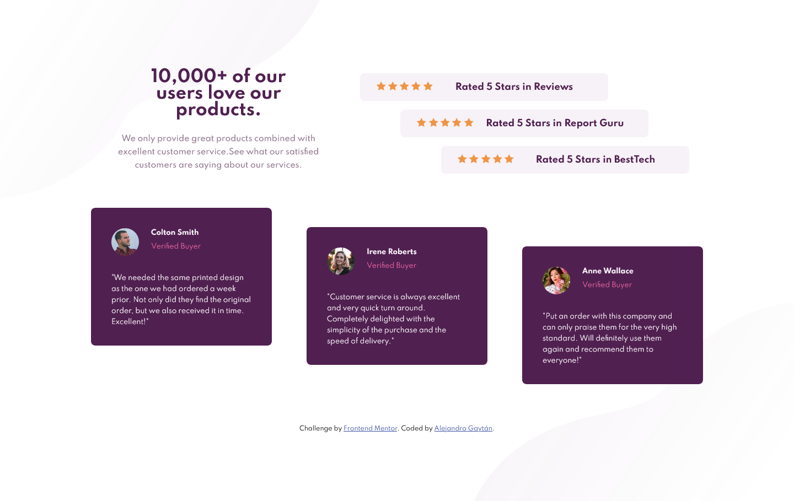

# Frontend Mentor - Social proof section solution

This is a solution to the [Social proof section challenge on Frontend Mentor](https://www.frontendmentor.io/challenges/social-proof-section-6e0qTv_bA).

## Table of contents

- [Overview](#overview)
  - [The challenge](#the-challenge)
  - [Screenshot](#screenshot)
  - [Links](#links)
- [My process](#my-process)
  - [Built with](#built-with)
  - [What I learned](#what-i-learned)
  - [Continued development](#continued-development)
  - [Useful resources](#useful-resources)
- [Author](#author)

## Overview

### The challenge

Users should be able to:

- View the optimal layout for the section depending on their device's screen size

### Screenshot

<div align="center">

  

  

</div>

### Links

- Solution URL: [Solution URL here](https://github.com/GGA-Alex/Social-Proof-Section)
- Live Site URL: [live site URL here](https://keen-payne-eee44b.netlify.app/)

## My process

### Built

- Semantic HTML5 markup
- CSS custom properties
- Flexbox
- CSS Grid
- Media queries
- Mobile-first workflow
- [Style-guide](style-guide.md)

### What I learned

```css
@media only screen and (min-width: 376px){

}
```

```css
.card {
  display: grid;
  grid-template-columns: 1fr 10fr;
}

.card .name {
  grid-column: 2 / 3;
}
```

### Continued development

- CSS Grid
- Media queries
- Mobile-first workflow


### Useful resources

- [Grid in CSS](https://developer.mozilla.org/en-US/docs/Web/CSS/grid) - This article helped me to understand the grid in CSS.
- [@media](https://developer.mozilla.org/en-US/docs/Web/CSS/@media) - This article helped me to understand media queries in CSS.
- []

## Author

- Website - [Alejandro Gaytan](https://github.com/GGA-Alex)
- Frontend Mentor - [@GGA-Alex](https://www.frontendmentor.io/profile/GGA-Alex)
